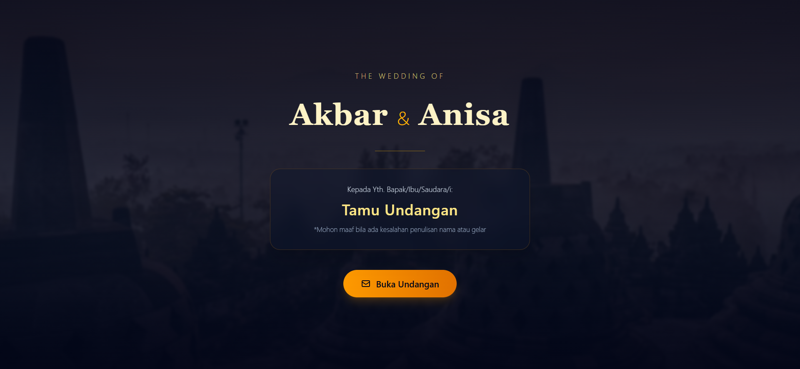
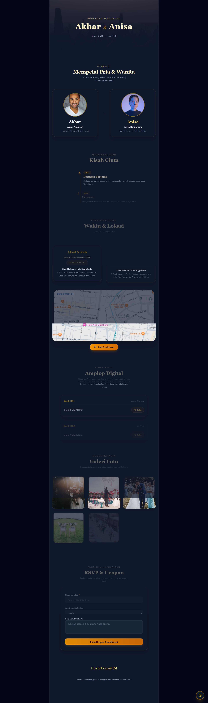

# 💍 Undangan Digital

Undangan pernikahan digital interaktif dengan personalisasi nama tamu, hitung mundur hari-H, musik latar, galeri foto, serta form konfirmasi kehadiran (RSVP) dan ucapan.

> 📸 **Screenshot:** 
[]
[] 

## ✨ Fitur

- 🖼️ **Cover screen** dengan nama tamu personal, diambil langsung dari parameter URL (`?to=NamaTamu`)
- ⏳ **Countdown timer** real-time menuju hari pernikahan
- 💑 **Profil mempelai** — foto dan informasi kedua mempelai
- 📖 **Love story** — linimasa (timeline) interaktif perjalanan kisah cinta kedua mempelai
- 📅 **Detail acara** — waktu akad & resepsi, lokasi, dan peta lokasi (Google Maps embed)
- 📷 **Galeri foto** prewedding
- 💳 **Amplop digital** — informasi rekening bank untuk tanda kasih dilengkapi fitur salin nomor rekening instan
- 🎵 **Musik latar** — otomatis diputar setelah undangan dibuka, bisa dikontrol manual
- 💌 **RSVP & ucapan** — tamu dapat mengonfirmasi kehadiran dan menulis ucapan, tersimpan di perangkat masing-masing
- 🎬 **Animasi scroll** pada setiap bagian


## 🛠️ Tech Stack

| Kategori | Teknologi |
|---|---|
| Library | React 19 |
| Styling | Tailwind CSS v4 |
| Animasi | Framer Motion |
| Build tool | Vite |
| Penyimpanan RSVP | Browser `localStorage` |

## 🧠 Konsep React yang Diterapkan

- **URL Query Parameters** (`URLSearchParams`) — membaca nama tamu dari link undangan tanpa menggunakan library routing
- **`useRef`** — kontrol elemen `<audio>` HTML (play/pause) secara langsung
- **`useEffect` + `setInterval`** — logic countdown real-time, lengkap dengan cleanup function untuk mencegah memory leak
- **Controlled Form** dengan *computed property name* — satu `handleChange` generik untuk menangani banyak input sekaligus
- **`localStorage` persistence** — data ucapan tamu tetap tersimpan meski halaman ditutup atau di-refresh
- **State lifting** — state ucapan dikelola di komponen induk (`App.jsx`) dan dibagikan lewat props, tanpa Context API karena skupnya cukup lokal

## 📁 Struktur Folder

```
src/
├── components/
│   ├── CoverScreen.jsx
│   ├── CountdownTimer.jsx
│   ├── CoupleInfo.jsx
│   ├── EventDetail.jsx
│   ├── Gallery.jsx
│   ├── MusicToggle.jsx
│   ├── RSVPForm.jsx
│   ├── WishesList.jsx
│   ├── DigitalGift.jsx
|   └── LoveStory.jsx
├── data/
│   └── weddingData.js
└── App.jsx
```

## 🚀 Menjalankan Project Secara Lokal

```bash
# Clone repository
git clone [url-repo-kamu]
cd undangan-digital

# Install dependency
npm install

# Jalankan development server
npm run dev
```

Buka `http://localhost:5173` di browser. Untuk melihat personalisasi nama tamu, tambahkan parameter URL, contoh:
```
http://localhost:5173/?to=Budi
```

Sesuaikan data acara (nama mempelai, tanggal, lokasi, dll) di `src/data/weddingData.js`.

## 📌 Rencana Pengembangan

- [ ] Sistem undangan multi-acara (data dinamis per tamu/link, bukan hardcode)
- [ ] Simpan data RSVP ke backend/database agar bisa diakses dari perangkat manapun
- [ ] Fitur hitung jumlah tamu yang konfirmasi hadir

## 👤 Dibuat oleh

Aji Kharisma Atmaja